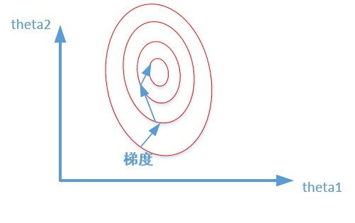
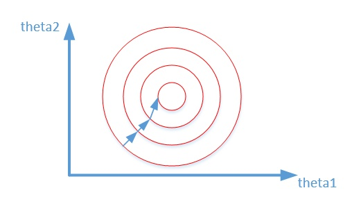
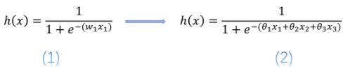

## 特征工程
概念：有这么一句话在业界广泛流传：**数据和特征决定了机器学习的上限，而模型和算法只是逼近这个上限而已**。那特征工程到底是什么呢？顾名思义，其本质是一项工程活动，目的是最大限度地从原始数据中提取特征以供算法和模型使用。通过总结和归纳，人们认为特征工程包括以下方面：


### 数据预处理
对于我们拿到的原始样本数据，在进行预处理时，通常会有如下问题出现：
- 不属于同一量纲：即特征的规格不一样，不能够放在一起比较。无量纲化可以解决这一问题；常用的方法是进行归一化的处理。
- 信息冗余：对于某些定量特征，其包含的有效信息为区间划分，例如学习成绩，假若只关心“及格”或“不及格”，那么需要将定量的考分，转换成“1”和“0”表示及格和未及格。二值化可以解决这一问题。
- 定性特征不能直接使用：某些机器学习算法和模型只能接受定量特征的输入，那么需要将定性特征转换为定量特征。最简单的方式是为每一种定性值指定一个定量值，但是这种方式过于灵活，增加了调参的工作。通常使用哑编码的方式将定性特征转换为定量特征：假设有N种定性值，则将这一个特征扩展为N种特征，当原始特征值为第i种定性值时，第i个扩展特征赋值为1，其他扩展特征赋值为0。哑编码的方式相比直接指定的方式，不用增加调参的工作，对于线性模型来说，使用哑编码后的特征可达到非线性的效果。其中One hot编码和dummy编码的区别见文献2。
- 存在缺失值：缺失值需要补充。
- 信息利用率低：不同的机器学习算法和模型对数据中信息的利用是不同的，之前提到在线性模型中，使用对定性特征哑编码可以达到非线性的效果。类似地，对定量变量多项式化，或者进行其他的转换，都能达到非线性的效果。

#### 无量纲化
无量纲化使不同规格的数据转换到同一规格。常见的无量纲化方法有标准化和区间缩放法。标准化的前提是特征值服从正态分布，标准化后，其转换成标准正态分布。区间缩放法利用了边界值信息，将特征的取值区间缩放到某个特点的范围，例如[0, 1]等。

##### 为什么要进行归一化和标准化？

我们在寻找最优解的过程也就是在使得损失函数值最小的theta1,theta2。
下面两幅图代表的是损失函数的等高线。


上图中，图一theta1,theta2是没有归一化时的等高线，图二是归一化后的等高线。可以看出数据归一化后，最优解的寻优过程明显会变得平缓，更容易正确的收敛到最优解。

##### 标准化
标准化需要计算特征的均值和标准差，公式表达为：
$x^`=\frac{x-\bar{X}}{S}$  其中$\bar{X}$为均值，$S$为方差。
使用preproccessing库的StandardScaler类对数据进行标准化的代码如下：
```
from sklearn.preprocessing import StandardScaler
#标准化，返回值为标准化后的数据
StandardScaler().fit_transform(iris.data)
```
##### 归一化
区间缩放法的思路有多种，常见的一种为利用两个最值进行缩放，公式表达为：
$x^`=\frac{x-min}{max-min}$
使用preproccessing库的MinMaxScaler类对数据进行区间缩放的代码如下：
```
from sklearn.preprocessing import MinMaxScaler
#区间缩放，返回值为缩放到[0, 1]区间的数据
MinMaxScaler().fit_transform(iris.data)
```
##### 归一化和标准化的本质？
归一化和标准化的本质就是一种线性变换。归一化的缩放是“拍扁”统一到区间（仅由极值决定），而标准化的缩放是更加“弹性”和“动态”的，和整体样本的分布有很大的关系。
那么二者之间该如何进行选择呢？
- 如果对输出结果范围有要求，用归一化
- 如果数据较为稳定，不存在极端的最大最小值，用归一化
- 如果数据存在异常值和较多噪音，用标准化，可以间接通过中心化避免异常值和极端值的影响

#### 二值化
定量特征二值化的核心在于设定一个阈值，大于阈值的赋值为1，小于等于阈值的赋值为0。
```
from sklearn.preprocessing import Binarizer 
#二值化，阈值设置为3，返回值为二值化后的数据
Binarizer(threshold=3).fit_transform(iris.data)
```

#### One-hot编码和哑变量编码

##### 为什么使用one-hot编码来处理离散型特征?
- 使用one-hot编码，将离散特征的取值扩展到了欧式空间，离散特征的某个取值就对应欧式空间的某个点。
- 将离散特征通过one-hot编码映射到欧式空间，是因为，在回归，分类，聚类等机器学习算法中，特征之间距离的计算或相似度的计算是非常重要的，而我们常用的距离或相似度的计算都是在欧式空间的相似度计算，计算余弦相似性，基于的就是欧式空间。
- 将离散型特征使用one-hot编码，确实会让特征之间的距离计算更加合理。比如，有一个离散型特征，代表工作类型，该离散型特征，共有三个取值，不使用one-hot编码，其表示分别是x_1 = (1), x_2 = (2), x_3 = (3)。两个工作之间的距离是，(x_1, x_2) = 1, d(x_2, x_3) = 1, d(x_1, x_3) = 2。那么x_1和x_3工作之间就越不相似吗？显然这样的表示，计算出来的特征的距离是不合理。那如果使用one-hot编码，则得到x_1 = (1, 0, 0), x_2 = (0, 1, 0), x_3 = (0, 0, 1)，那么两个工作之间的距离就都是sqrt(2).即每两个工作之间的距离是一样的，显得更合理。
- 对离散型特征进行one-hot编码是为了让距离的计算显得更加合理.

**哪些情况不需要进行归一化和编码？**
 基于树的方法是不需要进行特征的归一化，例如随机森林，bagging 和 boosting等。基于参数的模型或基于距离的模型，都是要进行特征的归一化。

##### sklearn如何实现one-hot编码和dummy编码?
使用preproccessing库的OneHotEncoder类对数据进行独热编码的代码如下：
```
from sklearn.preprocessing import OneHotEncoder
#独热编码，独热编码后的数据
OneHotEncoder().fit_transform(iris.target.reshape((-1,1)))
```

```
dp_dummies_test  = pd.get_dummies(test_df['Department'],prefix='DP')
#哑变量编码，然后删除其中的一列，冗余信息
dp_dummies_test.drop(['DP_Research & Development'], axis=1, inplace=True)
```
##### One-hot编码和哑变量编码的区别以及应用场景
###### one-hot encoding
one-hot编码保证了每一个取值只会使得一种状态处于“激活态”，也就是说这N种状态中只有一个状态位值为1，其他状态位都是0。举个例子，假设我们以学历为例，我们想要研究的类别为小学、中学、大学、硕士、博士五种类别，我们使用one-hot对其编码就会得到：
```
小学 -> [1,0,0,0,0]
中学 -> [0,1,0,0,0]
大学 -> [0,0,1,0,0]
硕士 -> [0,0,0,1,0]
博士 -> [0,0,0,0,1]
```
###### dummy encoding
哑变量编码直观的解释就是任意的将一个状态位去除。还是拿上面的例子来说，我们用4个状态位就足够反应上述5个类别的信息，也就是我们仅仅使用前四个状态位 [0,0,0,0] 就可以表达博士了。只是因为对于一个我们研究的样本，他已不是小学生、也不是中学生、也不是大学生、又不是研究生，那么我们就可以默认他是博士.所以，我们用哑变量编码可以将上述5类表示成：
```
小学 -> [1,0,0,0]
中学 -> [0,1,0,0]
大学 -> [0,0,1,0]
硕士 -> [0,0,0,1]
博士 -> [0,0,0,0]
```
###### 连续值的离散化为什么会提升模型的非线性能力？
简单的说，使用连续变量的LR模型，模型表示为公式（1），而使用了one-hot或哑变量编码后的模型表示为公式（2）

式中$x_1$表示连续型特征，$x_1$、$x_2$、$x_3$分别是离散化后在使用one-hot或哑变量编码后的若干个特征表示。这时我们发现使用连续值的LR模型用一个权值去管理该特征，而one-hot后有三个权值管理了这个特征，这样使得参数管理的更加精细，所以这样拓展了LR模型的非线性能力。

　　这样做除了增强了模型的非线性能力外，还有什么好处呢？这样做了我们至少不用再去对变量进行归一化，也可以加速参数的更新速度；再者使得一个很大权值管理一个特征，拆分成了许多小的权值管理这个特征的多个表示，这样做降低了特征值扰动对模型稳定性的影响，也降低了异常数据对模型的影响，进而使得模型具有更好的鲁棒性。
### 特征选择
特征选择主要有两个功能：
- 减少特征数量、降维，使模型泛化能力更强，减少过拟合
- 增强对特征和特征值之间的理解

#### 数据预处理
第一步对于拿到的数据，首先要进行概览，如考察各字段的缺失值，各字段的离群值统计，方差统计等，考察各特征与目标的相关性等。主要可以有如下方法。
1、 **去掉取值变化小的特征**：如果一个特征不发散，例如方差接近于0，也就是说样本在这个特征上基本上没有差异，这个特征对于样本的区分并没有什么用。可以把它作为特征选择的预处理，先去掉那些取值变化小的特征，然后再从接下来提到的的特征选择方法中选择合适的进行进一步的特征选择。
2、 变量特征选择能够对每一个特征进行测试，衡量该特征和响应变量之间的关系，根据得分扔掉不好的特征。这种方法比较简单，易于运行，易于理解，通常对于**理解数据**有较好的效果。
3、 卡方检验：检验自变量对因变量的相关性。
```
from sklearn.feature_selection import SelectKBest
from sklearn.feature_selection import chi2 

#选择K个最好的特征，返回选择特征后的数据
model1 = SelectKBest(chi2, k=2)
model1.fit_transform(iris.data, iris.target)

#卡方检验的p值和得分
model1.scores_  #得分
model1.pvalues_  #p-values 
```
4、 Pearson相关系数 Pearson Correlation:皮尔森相关系数是一种最简单的，能帮助理解特征和响应变量之间关系的方法，该方法衡量的是变量之间的线性相关性，结果的取值区间为[-1，1]，-1表示完全的负相关(这个变量下降，那个就会上升)，+1表示完全的正相关，0表示没有线性相关。Pearson Correlation速度快、易于计算，经常在拿到数据(经过清洗和特征提取之后的)之后第一时间就执行。Pearson相关系数的一个明显缺陷是，作为特征排序机制，他只对**线性关系敏感**。如果关系是非线性的，即便两个变量具有一一对应的关系，Pearson相关性也可能会接近0。
```
from sklearn.feature_selection import SelectKBest
from scipy.stats import pearsonr

#选择K个最好的特征，返回选择特征后的数据
#第一个参数为计算评估特征是否好的函数，该函数输入特征矩阵和目标向量，输出二元组（评分，P值）的数组，数组第i项为第i个特征的评分和P值。在此定义为计算相关系数
#参数k为选择的特征个数
SelectKBest(lambda X, Y: array(map(lambda x:pearsonr(x, Y), X.T)).T, k=2).fit_transform(iris.data, iris.target)
```
#### 基于学习模型的特征排序
这种方法的思路是直接使用你要用的机器学习算法，针对每个单独的特征和响应变量建立预测模型。假如某个特征和响应变量之间的关系是非线性的，可以用基于树的方法（决策树、随机森林）、或者扩展的线性模型等。
```
#以下算法给出了在波士顿房价数据集上使用sklearn的随机森林回归给出一个单变量选择的例子，对于每一个特征分别通过RF算法进行预测。最后根据评分来考察各特征的重要性。
from sklearn.cross_validation import cross_val_score, ShuffleSplit
from sklearn.datasets import load_boston
from sklearn.ensemble import RandomForestRegressor

#Load boston housing dataset as an example
boston = load_boston()
X = boston["data"]
Y = boston["target"]
names = boston["feature_names"]

rf = RandomForestRegressor(n_estimators=20, max_depth=4)
scores = []
for i in range(X.shape[1]):
     score = cross_val_score(rf, X[:, i:i+1], Y, scoring="r2",
                              cv=ShuffleSplit(len(X), 3, .3))
     scores.append((round(np.mean(score), 3), names[i]))
print sorted(scores, reverse=True)
```
#### 线性模型和正则化
基于机器学习模型的方法,有些机器学习方法本身就具有对特征进行打分的机制，例如回归模型，SVM，决策树，随机森林等。
下面将介绍如何用回归模型的系数来选择特征。越是重要的特征在模型中对应的系数就会越大，而跟输出变量越是无关的特征对应的系数就会越接近于0。在噪音不多的数据上，或者是数据量远远大于特征数的数据上，如果特征之间相对来说是比较独立的，那么即便是运用最简单的线性回归模型也一样能取得非常好的效果。
```
#下面是一个线性回归的例子，例子中的这个问题非常适合用线性模型来解：特征和响应变量之间全都是线性关系，并且特征之间均是独立的
from sklearn.linear_model import LinearRegression
import numpy as np
np.random.seed(0)
size = 5000
#A dataset with 3 features
X = np.random.normal(0, 1, (size, 3))
#Y = X0 + 2*X1 + noise
Y = X[:,0] + 2*X[:,1] + np.random.normal(0, 2, size)
lr = LinearRegression()
lr.fit(X, Y)
#A helper method for pretty-printing linear models
def pretty_print_linear(coefs, names = None, sort = False):
	if names == None:
		names = ["X%s" % x for x in range(len(coefs))]
	lst = zip(coefs, names)
	if sort:
		lst = sorted(lst,  key = lambda x:-np.abs(x[0]))
	return " + ".join("%s * %s" % (round(coef, 3), name)
								   for coef, name in lst)
print ("Linear model:", pretty_print_linear(lr.coef_))
```
下面例子是在上述例子基础上进行了一个简单的修改，特征之间引入了相关性；这时候模型就会变得不稳定，数据中细微的变化就可能导致模型的巨大变化（模型的变化本质上是系数，或者叫参数），这会让模型的预测变得困难，这种现象也称为多重共线性。
```
from sklearn.linear_model import LinearRegression

size = 100
np.random.seed(seed=5)

#引入相关性
X_seed = np.random.normal(0, 1, size)
X1 = X_seed + np.random.normal(0, .1, size)
X2 = X_seed + np.random.normal(0, .1, size)
X3 = X_seed + np.random.normal(0, .1, size)

Y = X1 + X2 + X3 + np.random.normal(0,1, size)
X = np.array([X1, X2, X3]).T

lr = LinearRegression()
lr.fit(X,Y)
print ("Linear model:", pretty_print_linear(lr.coef_))
#输出：Linear model: -1.291 * X0 + 1.591 * X1 + 2.747 * X2
```
#### 正则化
正则化就是把额外的约束或者惩罚项加到已有模型（损失函数）上，以防止过拟合并提高泛化能力。损失函数由原来的E(X,Y)变为E(X,Y)+alpha||w||，w是模型系数组成的向量（有些地方也叫参数parameter，coefficients），||·||一般是L1或者L2范数，alpha是一个可调的参数，控制着正则化的强度。使用L1正则化的模型建叫做Lasso回归，使用L2正则化的模型叫做Ridge回归。

##### L1正则化/Lasso
L1正则化将系数w的l1范数作为惩罚项加到损失函数上，由于正则项非零，这就迫使那些弱的特征所对应的系数变成0。因此L1正则化往往会使学到的模型很稀疏（系数w经常为0），这个特性使得L1正则化成为一种很好的特征选择方法。

Scikit-learn为线性回归提供了Lasso，为分类提供了L1逻辑回归。

下面的例子在波士顿房价数据上运行了Lasso，其中参数alpha是通过grid search进行优化的。
```
import numpy as np
from sklearn.linear_model import Lasso
from sklearn.preprocessing import StandardScaler
from sklearn.datasets import load_boston
from sklearn.linear_model import LinearRegression

def pretty_print_linear(coefs, names = [], sort = False):
	if len(names) == 0:
		names = ["X%s" % x for x in range(len(coefs))]
	lst = zip(coefs, names)
	if sort:
		lst = sorted(lst,  key = lambda x:-np.abs(x[0]))
	return " + ".join("%s * %s" % (round(coef, 3), name)
								   for coef, name in lst)

boston = load_boston()
scaler = StandardScaler()
X = scaler.fit_transform(boston["data"])
Y = boston["target"]
names = boston["feature_names"]

lasso = Lasso(alpha=.3)
lasso.fit(X, Y)

print ("Lasso model: ", pretty_print_linear(lasso.coef_, names, sort = True))
```
可以看到，很多特征的系数都是0。如果继续增加alpha的值，得到的模型就会越来越稀疏，即越来越多的特征系数会变成0。

然而，L1正则化像非正则化线性模型一样也是不稳定的，如果特征集合中具有相关联的特征，当数据发生细微变化时也有可能导致很大的模型差异。

##### L2正则化/Ridge
L2正则化将系数向量的L2范数添加到了损失函数中。由于L2惩罚项中系数是二次方的，这使得L2和L1有着诸多差异，最明显的一点就是，L2正则化**会让系数的取值变得平均**。对于关联特征，这意味着他们能够获得更相近的对应系数。还是以Y=X1+X2为例，假设X1和X2具有很强的关联，如果用L1正则化，不论学到的模型是Y=X1+X2还是Y=2X1，惩罚都是一样的，都是2 alpha。但是对于L2来说，第一个模型的惩罚项是2 alpha，但第二个模型的是4*alpha。可以看出，系数之和为常数时，各系数相等时惩罚是最小的，所以才有了L2会让各个系数趋于相同的特点。

可以看出，**L2正则化对于特征选择来说一种稳定的模型**，不像L1正则化那样，系数会因为细微的数据变化而波动。所以L2正则化和L1正则化**提供的价值是不同的**，L2正则化对于特征理解来说更加有用：表示能力强的特征对应的系数是非零。


相同点：都用于避免过拟合
不同点：
- L1可以让一部分特征的系数缩小到0，从而间接实现特征选择。所以L1适用于特征之间有关联的情况。
- L2让所有特征的系数都缩小，但是不会减为0，它会使优化求解稳定快速。所以L2适用于特征之间没有关联的情况
```
import numpy as np
from sklearn.linear_model import Lasso
from sklearn.linear_model import Ridge


def pretty_print_linear(coefs, names = [], sort = False):
	if len(names) == 0:
		names = ["X%s" % x for x in range(len(coefs))]
	lst = zip(coefs, names)
	if sort:
		lst = sorted(lst,  key = lambda x:-np.abs(x[0]))
	return " + ".join("%s * %s" % (round(coef, 3), name)
								   for coef, name in lst)


size = 100
#We run the method 10 times with different random seeds
for i in range(10):
	print ("Random seed %s" % i)
	np.random.seed(seed=i)
	X_seed = np.random.normal(0, 1, size)
	X1 = X_seed + np.random.normal(0, .1, size)
	X2 = X_seed + np.random.normal(0, .1, size)
	X3 = X_seed + np.random.normal(0, .1, size)
	Y = X1 + X2 + X3 + np.random.normal(0, 1, size)
	X = np.array([X1, X2, X3]).T
	lasso = Lasso(alpha=.3)
	lasso.fit(X,Y)
	print ("Linear model:", pretty_print_linear(lasso.coef_))
	ridge = Ridge(alpha=10)
	ridge.fit(X,Y)
	print ("Ridge model:", pretty_print_linear(ridge.coef_))

#输出
Random seed 0
Lasso model: 0.64 * X0 + 2.029 * X1 + 0.0 * X2
Ridge model: 0.938 * X0 + 1.059 * X1 + 0.877 * X2
Random seed 1
Lasso model: 0.893 * X0 + 1.657 * X1 + 0.0 * X2
Ridge model: 0.984 * X0 + 1.068 * X1 + 0.759 * X2
Random seed 2
Lasso model: 0.92 * X0 + 0.152 * X1 + 1.744 * X2
Ridge model: 0.972 * X0 + 0.943 * X1 + 1.085 * X2
Random seed 3
Lasso model: 0.0 * X0 + 1.285 * X1 + 1.475 * X2
Ridge model: 0.919 * X0 + 1.005 * X1 + 1.033 * X2
Random seed 4
Lasso model: 0.263 * X0 + 0.391 * X1 + 2.177 * X2
Ridge model: 0.964 * X0 + 0.982 * X1 + 1.098 * X2
Random seed 5
Lasso model: 0.0 * X0 + 0.588 * X1 + 2.103 * X2
Ridge model: 0.758 * X0 + 1.011 * X1 + 1.139 * X2
Random seed 6
Lasso model: 0.98 * X0 + 0.0 * X1 + 1.805 * X2
Ridge model: 1.016 * X0 + 0.89 * X1 + 1.091 * X2
Random seed 7
Lasso model: 1.16 * X0 + 1.252 * X1 + 0.366 * X2
Ridge model: 1.018 * X0 + 1.039 * X1 + 0.901 * X2
Random seed 8
Lasso model: 0.181 * X0 + 2.04 * X1 + 0.6 * X2
Ridge model: 0.907 * X0 + 1.071 * X1 + 1.008 * X2
Random seed 9
Lasso model: 0.427 * X0 + 0.126 * X1 + 1.998 * X2
Ridge model: 0.896 * X0 + 0.903 * X1 + 0.98 * X2
```
可以看出，不同的数据上L1 Lasso回归得到的模型（系数）相差甚远，但对于L2 Ridge正则化模型来说，结果中的系数非常的稳定，差别较小，都比较接近于1，能够反映出数据的内在结构。

##### 随机森林进行特征选择
随机森林使用的CART算法的生成树，使用Gini(基尼不纯度)指数来划分。利用不纯度可以确定节点（最优条件），对于分类问题，通常采用 基尼不纯度 或者 信息增益 ，对于回归问题，通常采用的是 方差 或者最小二乘拟合。对于一个决策树森林来说，可以算出**每个特征平均减少了多少不纯度，并把它平均减少的不纯度作为特征选择的值，这个值体现了特征的重要性**。
```
from sklearn.datasets import load_boston
from sklearn.ensemble import RandomForestRegressor
import numpy as np
#Load boston housing dataset as an example
boston = load_boston()
X = boston["data"]
Y = boston["target"]
names = boston["feature_names"]
rf = RandomForestRegressor()
rf.fit(X, Y)
print ("Features sorted by their score:")
print (sorted(zip(map(lambda x: round(x, 4), rf.feature_importances_), names), reverse=True))
```
使用基于不纯度的方法的时候，要记住：1、这种方法存在**偏向** ，对具有更多类别的变量会更有利；2、对于存在**关联的多个特征**，其中任意一个都可以作为指示器（优秀的特征），并且一旦某个特征被选择之后，其他特征的重要度就会急剧下降，因为不纯度已经被选中的那个特征降下来了，其他的特征就很难再降低那么多不纯度了，这样一来，只有先被选中的那个特征重要度很高，其他的关联特征重要度往往较低。在理解数据时，这就会造成误解，导致错误的认为先被选中的特征是很重要的，而其余的特征是不重要的，但实际上这些特征对响应变量的作用确实非常接近的。

#### 稳定性选择
稳定性选择是一种基于二次抽样和选择算法相结合较新的方法，选择算法可以是回归、SVM或其他类似的方法。它的主要思想是在**不同的数据子集和特征子集上运行特征选择算法，不断的重复，最终汇总特征选择结果**，比如可以统计某个特征被认为是重要特征的频率（被选为重要特征的次数除以它所在的子集被测试的次数）。理想情况下，重要特征的得分会接近100%。稍微弱一点的特征得分会是非0的数，而最无用的特征得分将会接近于0。
```
#以下是sklearn在 随机lasso 和 随机逻辑回归 中有对稳定性选择的实现。

from sklearn.linear_model import RandomizedLasso
from sklearn.datasets import load_boston
boston = load_boston()

#using the Boston housing data. 
#Data gets scaled automatically by sklearn's implementation
X = boston["data"]
Y = boston["target"]
names = boston["feature_names"]

rlasso = RandomizedLasso(alpha=0.025)
rlasso.fit(X, Y)

print ("Features sorted by their score:")
print (sorted(zip(map(lambda x: round(x, 4), rlasso.scores_), 
                 names), reverse=True))
#输出
Features sorted by their score: [(1.0, ‘RM’), (1.0, ‘PTRATIO’), (1.0, ‘LSTAT’), (0.62, ‘CHAS’), (0.595, ‘B’), (0.39, ‘TAX’), (0.385, ‘CRIM’), (0.25, ‘DIS’), (0.22, ‘NOX’), (0.125, ‘INDUS’), (0.045, ‘ZN’), (0.02, ‘RAD’), (0.015, ‘AGE’)]
```
在上边这个例子当中，最高的3个特征得分是1.0，这表示他们总会被选作有用的特征（当然，得分会收到正则化参数alpha的影响，但是sklearn的随机lasso能够自动选择最优的alpha）。接下来的几个特征得分就开始下降，但是下降的不是特别急剧，这跟纯lasso的方法和随机森林的结果不一样。能够看出稳定性选择对于克服过拟合和对数据理解来说都是有帮助的：总的来说，好的特征不会因为有相似的特征、关联特征而得分为0，这跟Lasso是不同的。对于特征选择任务，在许多数据集和环境下，稳定性选择往往是性能最好的方法之一。

当用特征选择的方法来理解数据的时候要留心，特征选择模型的稳定性非常重要，**稳定性差的模型很容易就会导致错误的结论**。对数据进行二次采样然后在子集上运行特征选择算法能够有所帮助，如果在各个子集上的结果是一致的，那就可以说在这个数据集上得出来的结论是可信的，可以用这种特征选择模型的结果来理解数据。

### 数据降维
当特征选择完成后，可以直接训练模型了，但是可能由于特征矩阵过大，导致计算量大，训练时间长的问题，因此降低特征矩阵维度也是必不可少的。常见的降维方法除了以上提到的基于L1惩罚项的模型以外，另外还有主成分分析法（PCA）和线性判别分析（LDA）。
#### PCA

```
from sklearn.decomposition import PCA
#主成分分析法，返回降维后的数据
#参数n_components为主成分数目
PCA(n_components=2).fit_transform(iris.data)
```

### 文献
[文献1：使用sklearn做单机特征工程](http://www.cnblogs.com/jasonfreak/p/5448385.html)  
[文献2：离散型特征编码方式：one-hot与哑变量](https://www.cnblogs.com/lianyingteng/p/7792693.html)
[文献3：为什么要对数据进行归一化处理？](https://zhuanlan.zhihu.com/p/27627299)
[文献4：干货：结合Scikit-learn介绍几种常用的特征选择方法](http://dataunion.org/14072.html)
[文献5：PCA的数学原理](http://blog.codinglabs.org/articles/pca-tutorial.html)