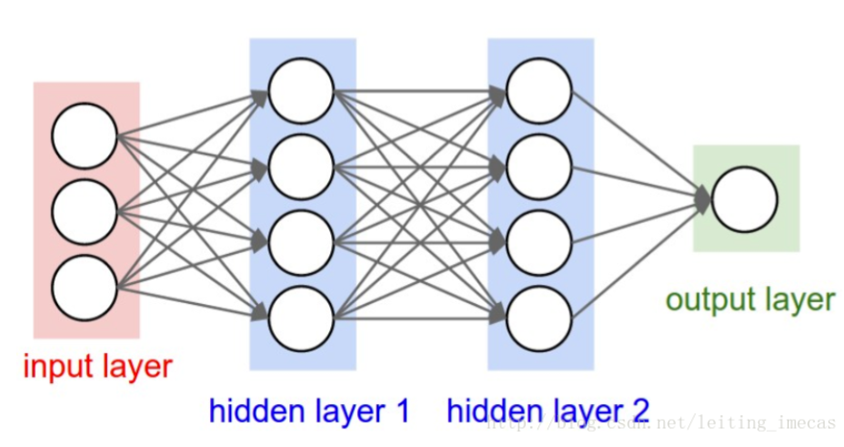
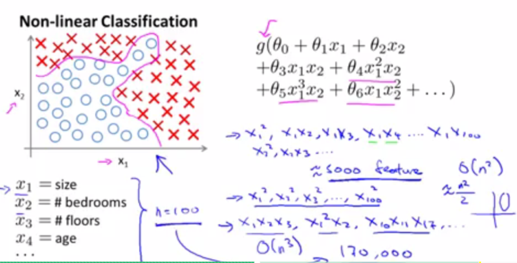
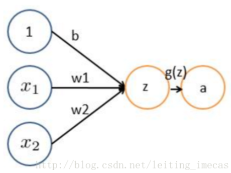
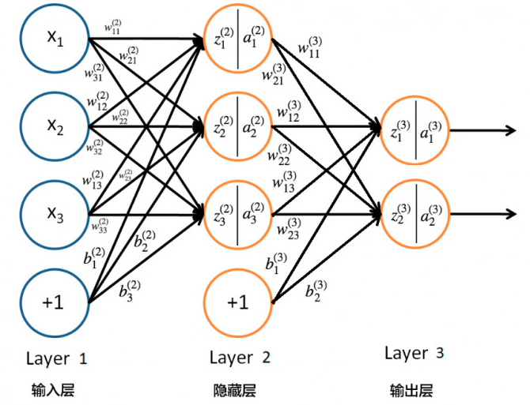
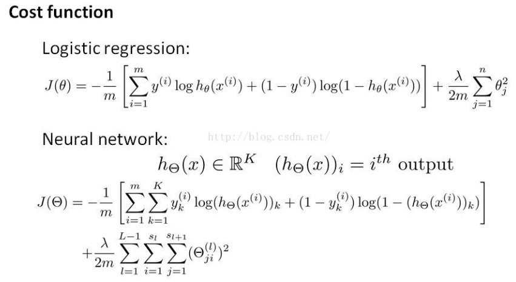
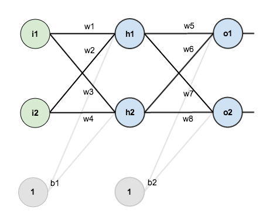
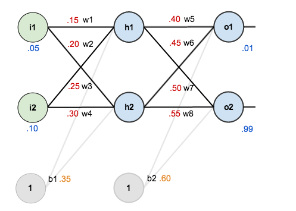
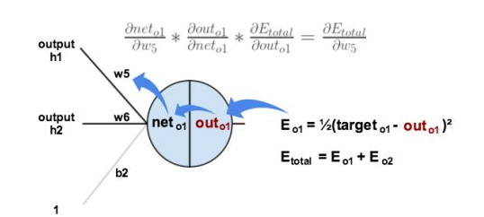
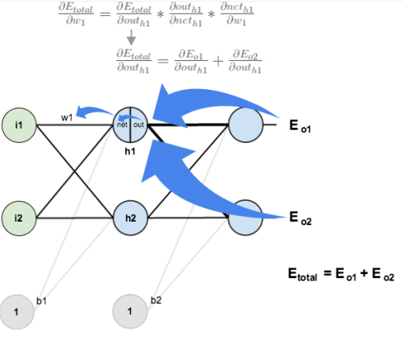

## 神经网络
### 一些基本概念

  

1、通常一个神经网络由一个input layer，多个hidden layer和一个output layer构成。
2、图中圆圈可以视为一个神经元（又可以称为感知器）
3、设计神经网络的重要工作是设计hidden layer，及神经元之间的权重
4、添加少量隐层获得浅层神经网络SNN；隐层很多时就是深层神经网络DNN
5、前面每一层输入经过线性变换wx+b后还用到了sigmoid函数，在神经网络的结构中被称为传递函数或者激活函数。除了sigmoid，还有tanh、relu等别的激活函数。激活函数使线性的结果非线性化。每个隐层都会配一个激活函数，提供非线性变化。

### 为什么需要神经网络？
有很多非线性应用的场景，比如图片识别等应用；虽然很多复杂的应用场景也可以通过多个线性模型进行叠加得到，但不是一个好算法，因为会出现overfitting的问题并且处理这么多的features计算也很耗时。神经网络提供了一种更好的处理这种当特征很大时的复杂问题的方法。
  
如上图，想要完全拟合出图中的粉色曲线，你可以做的是apply logistic regression with a lot of nonlinear features，就象图中的$g(\theta)$函数那样。可见这个函数过于复杂，会出现过拟合的问题。

### 从逻辑回归到神经元
先看一个逻辑回归的简单表示：
$z = b+\omega_1 x_1+\omega_2 x_2$
sigmoid函数为：
$a =g(z) = \frac{1}{1+e^{-z} }$
LR可以理解为如下结构,可见逻辑回归就是一个简单的单层神经元。**神经网络就是逻辑回归的推广，逻辑回归可看成没有隐藏层的神经网络。**
  

### 神经网络的计算表示
下图是一个三层神经网络结果图，其中一个神经元的输出是另一个神经元的输入，+1项表示的是偏置项。这是一个还有一层隐含层的神经网络模型，L1层称为输入层，L2层称为隐含层，L3层称为输出层。
  
这里给出各数学表达的含义：
${a_i}^{(l)}$表示的是第$l$层的第$i$个神经元的输出,${a_i}^{(l)}=f({z_i}^{(l)})$,$f$为$sigmoid$函数。
给出一个示例如下：
${a_1}^{(2)}=g({\omega_{11}}^{(1)} x_1+{\omega_{12}}^{(1)} x_2+{\omega_{13}}^{(1)} x_3+{b_1}^{(1)})$
上式中$W_{ij}$相邻两层神经元之间的权值，控制着从层$i$到层$j$的映射。神经网络的任务也就是计算权重矩阵，得到模型的参数。也就相当于直线拟合y=k*x+b中的待求参数k和b。

#### 神经网络的Cost Function
上文中提到神经网络是逻辑回归的推广，神经网络的代价函数$J(\theta)$的表达可以理解为各层代价函数(误差函数)之和。
 
通过**梯度下降法**就可以有效的求解最小化cost函数。

### BP算法
误差逆传播算法（error back propagation）是神经网络中最有代表性的算法，也是使用最多的算法之一。
BP算法是一个迭代算法，它的基本思想为：(1) 先计算每一层的状态和激活值，直到最后一层（即信号是前向传播的）；(2) 计算每一层的误差，误差的计算过程是从最后一层向前推进的（这就是反向传播算法名字的由来）；(3) 更新参数（目标是误差变小），迭代前面两个步骤，直到满足停止准则（比如相邻两次迭代的误差的差别很小）。
它的学习规则是：**使用梯度下降法，通过反向传播（就是一层一层往前传）不断调整网络的权值和阈值，最后使全局误差系数最小。学习本质就是：对各连接权值的动态调整**。

### BP算法执行的流程（前向传递和逆向更新）
在手工设定了神经网络的层数，每层的神经元的个数，学习率 η后，BP 算法会先随机初始化每条连接线权重和偏置，然后对于训练集中的每个输入 x 和输出 y，BP 算法都会先执行前向传输得到预测值，然后根据真实值与预测值之间的误差执行逆向反馈更新神经网络中每条连接线的权重和每层的偏好。在没有到达停止条件的情况下重复上述过程。

其中，停止条件可以是下面这三条：
● 权重的更新低于某个阈值的时候
● 预测的错误率低于某个阈值
● 达到预设一定的迭代次数

下面通过一个完整的例子来看一下完整的BP算法执行的过程。下图为一个基础的神经网络架构。
 

**前向传输（Feed-Forward）**

首先都会对神经网络的权值和偏置项设定一个初始值，初始值的设定如下图所示：
 
$h_1$的计算过程如下：
$h_1=\omega_1*i_1+\omega_2*i_2+b_1*1$，将初始值带入得到结果：
$h_1=0.15*0.05+0.25*0.1+0.35*1=0.3775$
对于$h_1$经过激活函数$sigmoid$后的输出为：
$out_{h_1}=\frac{1}{1+e^{-h_1}}=\frac{1}{1+e^{-0.3775}}=0.593269992$
其后关于$h_2$、$o_1$、$o_2$的计算方法类似。
最后经过从输入层=>隐藏层=>输出层，一层一层的计算所有神经元的输出值。

下一步计算误差，通过均方误差来统计总的误差：
$E_{total}=\sum \frac{1}{2}(target-output)^2$,对于上图来说，
$E_{total}=E_{o1}+E_{o2}$

**逆向反馈（Back Propagation）**
逆向反馈是BP算法的精髓，为了使得预测值逼近目标值，BP算法是通过更新迭代权值和偏置值来达到目的的。而在这个过程中，是通过梯度下降算法和链式法则进行的。
这里以$\omega_5$的计算为例进行示例，来看一下权值$\omega_5$对最终误差的影响，记作：$\frac{\partial E_{total}}{\partial \omega_5}$，几何含义是沿着梯度方向（最快方向）找到最优的$\omega$值。

 
然后通过链式法则，一层一层往前推进，由误差=>激励函数输出=>激励函数输入(连接其各神经元的汇总值)=>$\omega_5$
$\frac{\partial E_{total}}{\partial \omega_5}=\frac{\partial E_{total}}{\partial out_{o1}}*\frac{\partial out_{o1}}{\partial net_{o1}}*\frac{\partial net_{o1}}{\partial \omega_5}$

对于隐藏层的链式法则，如下图所示，区别在于，$h_1$受$E_{o1}+E_{o2}$共同作用。
 

### 代码实现
[神经网络算法实现]

### 参考文献
[文献1：A Step by Step Backpropagation Example](https://mattmazur.com/2015/03/17/a-step-by-step-backpropagation-example/)  
